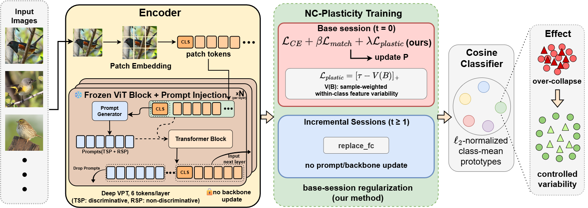

# Neural Collapse-Guided Plasticity Regularization for Prompt-based Few-Shot Class-Incremental Learning

**ACCV 2026** | Accepted

<p align="center">
  
</p>

## Overview

Prompt-based FSCIL methods freeze a ViT backbone and adapt only lightweight prompts, but discriminative base training can cause **excessive within-class feature collapse** — reducing the geometric capacity needed for novel-class prototype formation.

We propose **NC-Plasticity**, a lightweight base-session loss that imposes a soft lower bound on within-class feature variability:

$$\mathcal{L}_{\text{plastic}} = [\tau - V(\mathcal{B})]_+$$

- Drop-in regularizer: no backbone change, no new parameters, no inference overhead
- Applied only during base training; incremental sessions unchanged
- Consistent improvements over SEC-Prompt across all three benchmarks

## Results

| Dataset | Baseline AA | +NC-Plasticity AA | Δ |
|---------|-------------|-------------------|---|
| CUB-200 | 85.36±0.12 | **85.71±0.20** | +0.35 |
| CIFAR-100 | 89.11±0.21 | **89.85±0.11** | +0.74 |
| ImageNet-R | 77.22±0.16 | **77.72±0.18** | +0.50 |

*(paired 15-seed protocol, SEC-Prompt backbone, mean ± std, p < 10⁻⁵)*

## Requirements

```
pip install -r requirements.txt
```

Tested with `torch==2.1.0`, `timm==0.6.7`.

## Datasets

Each dataset is loaded from a fixed relative path under `./data/`, with the base/incremental session splits defined by index-list files:

| Dataset | Config folder | Default split | Expected layout |
|---------|--------------|---------------|------------------|
| CUB-200-2011 | `configs/cub/` | 100 base / 10×10 incremental | `./data/cub/{train,test}/<class>/*.jpg` + `./data/index_list/cub/session_*.txt` |
| CIFAR-100 | `configs/cifar100/` | 60 base / 5×8 incremental | auto-downloaded to `./data/` (torchvision) + `./data/index_list/cifar100/session_*.txt` |
| ImageNet-R | `configs/imagenet_r/` | 200 base / 10×10 incremental | `./data/imagenet-r/{train,test}/<class>/*.jpg` + `./data/index_list/imagenet-r/session_*.txt` |

`train`/`test` folders follow the standard `torchvision.datasets.ImageFolder` layout (one subfolder per class). The `session_N.txt` files list the fixed few-shot samples for each incremental session and follow the standard FSCIL session-split protocol used in prior work (e.g., CEC/SAVC).

## Running Experiments

**Single-seed run (main.py):**
```bash
python main.py --config configs/cub/nc_plasticity.json
python main.py --config configs/cub/baseline.json
```

**Paired 15-seed protocol (Table 4 in paper):**
```bash
python run_multiseed.py --config configs/cub/nc_plasticity.json
python run_multiseed.py --config configs/cifar100/nc_plasticity.json
python run_multiseed.py --config configs/imagenet_r/nc_plasticity.json
```

## Hyperparameters

| | Base Session | Incremental | NC-Plasticity |
|--|-------------|-------------|---------------|
| Batch size | 32 | 16 | — |
| LR | 0.01 | 0.001 | — |
| Epochs | 30 | 10 | — |
| Optimizer | SGD (wd=5e-3) | SGD | — |
| τ | — | — | **0.5** |
| λ | — | — | **1.0** |

## Code Structure

```
backbone/          # ViT-B/16 with Deep VPT
configs/
  cub/             # baseline.json, nc_plasticity.json
  cifar100/        # baseline.json, nc_plasticity.json
  imagenet_r/      # baseline.json, nc_plasticity.json
models/            # NC-Plasticity loss, SEC-Prompt, model factory
utils/             # data manager, neural_collapse.py, metrics
main.py            # single-seed entry point
trainer.py         # training loop
run_multiseed.py   # paired multi-seed evaluation (15-seed protocol)
```

## License

This project is released under the [MIT License](LICENSE).
